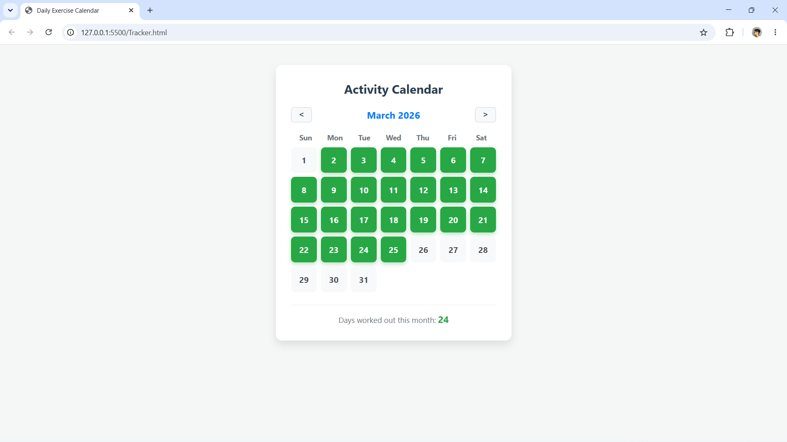

# Daily Exercise Calendar

A frontend web application for tracking daily exercise progress, built with HTML, CSS, JavaScript, and browser local storage. 

This project provides a simple, clean, and interactive interface to help users maintain exercise streaks and monitor their monthly workout consistency.

## Features

* **Interactive Calendar Grid:** Users can click on specific days to toggle their workout completion status.
* **Persistent Data Tracking:** Utilizes the browser's native `localStorage` API to ensure progress is saved locally, meaning data remains intact even after refreshing or closing the browser.
* **Dynamic Statistics:** Automatically calculates and displays the total number of workout days completed within the current month.
* **Month-to-Month Navigation:** Includes intuitive controls to easily flip between past and future months.
* **Responsive UI/UX Design:** Features a clean, card-based interface with hover states, active states, and a modern color palette.

## Tech Stack

* **HTML5:** Semantic structure and layout.
* **CSS3:** Custom styling, CSS Grid for the calendar layout, and interactive transition effects.
* **Vanilla JavaScript:** DOM manipulation, date object handling, and local storage state management.

## Installation

Because this is a static frontend application that uses browser storage, no server or complex installation is required.

### Running via VS CODE 
1. Clone the repository to your local machine:

```bash
git clone https://github.com/adityavijaymohanpandey-cloud/Exercise-Tracker.git
```

2. Open the newly created `Exercise-Tracker` folder in VS Code.
3. If you have the Live Server extension installed, click `Go Live` in the bottom right corner to launch the application.

(Alternative: You can simply navigate to the folder in your standard file explorer and double-click the `Tracker.html` file to open it directly in `Chrome, Firefox, Safari, or Edge`).

## Screenshots


## 🔒 Privacy Note

All tracking data is handled client-side via `localStorage`. No personal exercise data is pushed to GitHub, transmitted over the internet, or stored in an external database.

## Academic Project

Developed as a web development academic project for learning purpose.
